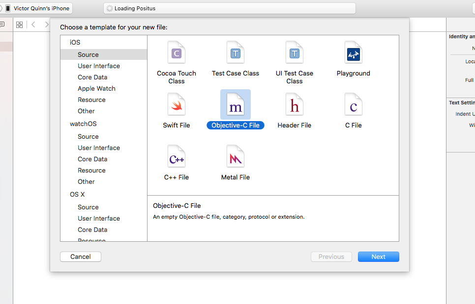
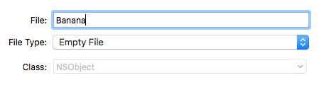
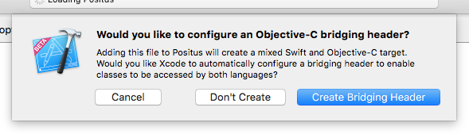

# Overview

[](https://locationkit.io)

SocialRadar's [LocationKit](https://locationkit.io) SDK for iOS provides
advanced location technology to offer developers higher accuracy location, lower
battery drain, automatic venue recognition and detailed location analytics.

LocationKit enables you to add enhanced location capabilities, and therefore
personalized experiences, to your mobile applications without the need for
location expertise.

Looking for our [Android documentation](https://docs.locationkit.io/android)?

### How it works

LocationKit processes location signals through a private location manager
instance, analyzing activity and validating data within the private SocialRadar
cloud. It pairs this with other sensor information on the device such as the
compass, accelerometer, and others to more accurately determine the user's
location while minimizing battery drain. Location data is seamlessly paired with
SocialRadar's best of breed location database full of addresses, venues, events,
and more which it delivers to your app. Anonymized consumer insights may be
shared with app publishers and marketing firms.

### Operating Requirements

- Device capable of running iOS 7.x or above
- Device capable of properly returning location signals

### Battery Consumption

Battery consumption is extremely efficient – LocationKit averages less than 1.7%
battery consumption per hour under normal usage, depending on the type of device
used and user activity level.

### Transparent operation

Aside from the required iOS Location Services dialog, LocationKit never surfaces
dialog boxes, errors, or notifications directly to a consumer.

# Quickstart

Follow these instructions or watch our Getting Started video:

<iframe class="videoEmbed" width="560" height="315"
src="https://www.youtube.com/embed/Hm23x4krM_c" frameborder="0" allowfullscreen>
</iframe>

## 1. Obtain an API Key

The first thing you'll need to do is to
<a href="https://dashboard.locationkit.io">sign up for an account</a> on our
Developer Dashboard. You will create your account and receive your API token.

Within the Developer Dashboard, you will be able to find your API token, and
find insights into the location-based usage of your app with LocationKit.

We have seeded the Dashboard with some sample data so you can explore the data
and insights your app will get once you've integrated LocationKit.

## 2. Install the LocationKit CocoaPod

The easiest way to start using LocationKit in your project is by using
[CocoaPods](https://cocoapods.org); add LocationKit to your Podfile with the
code on the right.

```ruby
pod 'LocationKit', '~> 2.2.0'
```

Then just run `pod install` from your project root.

## 3. Configure your project

In your project settings, under **Capabilities**, turn on the
**Background Modes** switch and enable **Location Updates** as shown in the
following screenshot:


## 4. Add 2 items to your Info.plist file

Both of these items inform your users of how your app is using Location so
provide a useful description. The users will see this text in a prompt when
your app first starts LocationKit and in the Privacy settings for Location
for your app.

1. `NSLocationAlwaysUsageDescription`
1. `Privacy - Location Usage Description`

See our screenshot below:


## 5. Create an Objective-C Bridging Header (Swift-only)
Since LocationKit is an Objective-C library, you'll need to create an
Objective-C bridging header in order to use it with Swift.

1. Create a new Objective-C file to your project

1. Give it any name you'd like. (e.g. 'Banana') For *File Type*, leave it at its
default, Empty File and pick a place in your project to save it

1. When it prompts you to "configure an Objective-C bridging header" click
*Create Bridging Header*

1. You can then delete the file you just created (e.g. 'Banana.m') but you'll
notice a new file created called:
*{Your Project Name}-Bridging-Header.h*
1. Now import LocationKit in the bridging header file:
`#import <LocationKit/LocationKit.h>`
1. That's it! You can now use LocationKit in any of your Swift code!

## 6. Start LocationKit

We recommend starting LocationKit in your AppDelegate, particularly in the
`didFinishLaunchingWithOptions` method so it's accessible and running throughout
your app. Start it with the snippet on the right:

```objective_c
[[LocationKit sharedInstance] startWithApiToken:@"your_api_token" delegate:nil];
```

```swift
LocationKit.sharedInstance().startWithApiToken("your_api_token", delegate:nil)
```

Optionally, you can provide a `LocationKitDelegate` which will receive a
constant stream of updates as they come in. Here we have supplied `nil` so no
delegate will receive the background updates and they will be ignored.

# Operation

## Start LocationKit

> Start LocationKit with a nil delegate

```objective_c
[[LocationKit sharedInstance] startWithApiToken:@"your_api_token" delegate:nil];
```

```swift
LocationKit.sharedInstance().startWithApiToken("your_api_token", delegate:nil)
```

*Use:* Kick off LocationKit using the API token you received from the [Developer
Dashboard](https://dashboard.locationkit.io)

*Optional:* Provide an object implementing our `LocationKitDelegate` protocol
to receive background updates when events occur such as getting a new location
or arriving/leaving a place.

> Start LocationKit with an object implementing the LocationKitDelegate protocol

```objective_c
[[LocationKit sharedInstance] startWithApiToken:@"your_api_token" delegate:myDelegate];
```

```swift
LocationKit.sharedInstance().startWithApiToken("your_api_token", delegate:myDelegate)
```

*Notes:*

* Due to the use of [ARC](https://en.wikipedia.org/wiki/Automatic_Reference_Counting)
in iOS, you must make sure to keep this delegate around. So don't make it a
local variable as it'll get cleaned up by iOS, we suggest adding it as an
instance variable owned by your ViewController or AppDelegate or wherever you
have initialized LocationKit.
* This will require permission from your users to run in the background, which
you will have if you configured things following the Getting Started
instructions above.

## Start LocationKit with options

*Use:* We have some options which can be supplied to slightly alter the
default behavior of LocationKit. To use them, start with an NSDictionary with
our constants as the keys.

The options we have available:

> Example of starting LocationKit with the timed updates option

```objective_c
NSDictionary *options = @{LKOptionTimedUpdatesInterval: @10}
[[LocationKit sharedInstance] startWithApiToken:@"your_api_token" delegate:myDelegate options:options];
```

```swift
var options:NSDictionary = [
    LKOptionTimedUpdatesInterval: 10
];
var locationKit = LocationKit.sharedInstance()
locationKit.startWithApiToken("your_api_token", delegate:myDelegate, options:options)
```

* **LKOptionTimedUpdatesInterval** - Start LocationKit with a timed interval
update. For example, this would allow you to receive an update every 60 seconds
overriding LocationKit's default behavior. Note: For the first 5 minutes after
install, LocationKit will be in a higher mode so your interval won't take effect
until after that first 5 minutes. Also, this has the potential to significantly
increase battery drain so generally we don't recommend it!

> Example of starting LocationKit with iOS CoreMotion manager rather than accelerometer

```objective_c
NSDictionary *options = @{LKOptionUseiOSMotionActivity: YES}
[[LocationKit sharedInstance] startWithApiToken:@"your_api_token" delegate:myDelegate options:options];
```

```swift
var options:NSDictionary = [
    LKOptionUseiOSMotionActivity: true
];
var locationKit = LocationKit.sharedInstance()
locationKit.startWithApiToken("your_api_token", delegate:myDelegate, options:options)
```

* **LKOptionUseiOSMotionActivity** - By default, LocationKit will use the
device's accelerometer to determine user motion activity and take action based
on it. We do things like throttle the GPS up and down to minimize battery drain
based on whether a user is walking or sitting still. By enabling this option,
you can tell LocationKit to use the [CMMotionActivityManager](https://developer.apple.com/library/ios/documentation/CoreMotion/Reference/CMMotionActivityManager_class/index.html#//apple_ref/occ/cl/CMMotionActivityManager)
instead of the accelerometer. This will result in lower battery drain because it
uses the motion coprocessor on the device for this detection rather than the
accelerometer, however it will surface a dialog to the user if your app does not
yet have permission to track the user's movements. For some apps (e.g. a fitness
app) you have likely already prompted the user for this permission so it is wise
to turn this on.

> Example of starting LocationKit in Foreground-only mode

```objective_c
NSDictionary *options = @{LKOptionWhenInUseOnly: YES}
[[LocationKit sharedInstance] startWithApiToken:@"your_api_token" delegate:myDelegate options:options];
```

```swift
var options:NSDictionary = [
    LKOptionWhenInUseOnly: true
];
var locationKit = LocationKit.sharedInstance()
locationKit.startWithApiToken("your_api_token", delegate:myDelegate, options:options)
```

* **LKOptionWhenInUseOnly** - By default, LocationKit requires the
`NSLocationAlwaysUsageDescription` permission to be set in the Info.plist and
will prompt the user for permission to run always in the background. You can
override this and require LocationKit to only run in the foreground. To do this,
add the `NSLocationWhenInUseUsageDescription` permission to the Info.plist.
Note: this will severely impact the usefulness of the location analytics we
provide, make all of the background updates impossible (because we cannot
provide background updates without access to the user's location in the
background), and diminish the accuracy of place lookups (because a lot of what
we do with LocationKit involves monitoring sensors on the device while the app
is in the background and we can't do that without having permission to do so)
If you have questions, contact us at
[support@locationkit.io](support@locationkit.io)

## Pause

> To pause LocationKit

```objective_c
[[LocationKit sharedInstance] pause];
```

```swift
LocationKit.sharedInstance().pause()
```

*Use:* Pause LocationKit and stop receiving locations and visits

*Note:* Pausing LocationKit will prevent you from receiving any further updates
to locations, places, visits, and so on so do so sparingly. It will prevent
LocationKit from continuing to run in the background and significantly diminish
the usefulness of our location-based developer insights. We strongly recommend
not pausing LocationKit.

## Resume

*Use:* In order to once again receive updates and get locations or places after you
have paused it, you must resume LocationKit.

> To resume LocationKit after it has been paused

```objective_c
NSError *error = [[LocationKit sharedInstance] resume];
```

```swift
let error = LocationKit.sharedInstance().resume()
```

If there was some issue resuming LocationKit, the error returned from this
method will be non-`nil`

# High Accuracy Location

LocationKit provides a higher level of location accuracy than Apple's
CoreLocation.

We are able to do this by utilizing sensors other than the GPS on the device and
pairing it with our venue database and some proprietary algorithms to clean up
the raw GPS points supplied by Apple's Location Manager and exclude outliers.

Getting GPS data directly from Apple is like drinking from a firehose at times
and getting a raw, unfiltered stream of locations and acting on them within your
app can lead to inconsistencies which degrade experience for your users. By
using LocationKit, you can have a greater confidence in the locations for your
app without having to maintain a team of location experts in-house.

As an illustrative example, the GPS will often drift, even when the user is not
moving. It will sometimes give more accurate points and sometimes less accurate
points. LocationKit will monitor and intelligently filter out a lot of the bad
data from this GPS drift. If we notice the accelerometer and compass are unmoved
yet the GPS thinks the device moved 100 feet away, we know it's likely suspect
and will filter that point out, making sure your app doesn't get that crazy
outlier.

As another example, it is very difficult to ascertain the user location,
particularly in an urban environment as the GPS signal tends to be attenuated by
buildings and will often bounce off them as well. Using only the raw GPS feed
you are very likely to end up with a bogus location for your user. LocationKit
will automatically monitor not only the GPS data, but also the compass and
accelerometer so it knows that the user didn't just teleport across the street,
it is likely there is a GPS reflection off the nearby buildings. LocationKit
will know, from the compass data that the user took a left turn into this
building, which we have in our extensive [proprietary venue database](https://locationkit.io/smart-polygons-shaping-a-more-intelligent-location/)
so we know which building the user entered even though their GPS chip alone may
point them as across the street due to reflection.

Suffice it to say there is a lot we do too in order to supply a higher
accuracy location.

By using LocationKit in your app, you put all the expertise of our location
experts without having to think about it. Your location data will be more
accurate resulting in a better experience for your users.

## Single Location Request

> To quickly obtain the user’s most recent location coordinates, execute the following:

```objective_c
[[LocationKit sharedInstance] getCurrentLocationWithHandler:^(CLLocation *location, NSError *error) {
    if (error == nil) {
        NSLog(@"%.6f, %.6f, %@",
            location.coordinate.latitude,
            location.coordinate.longitude,
            location.timestamp);
    } else {
        NSLog(@"Error: %@", error);
    }
}];
```

```swift
LocationKit.sharedInstance().getCurrentLocationWithHandler { (location:CLLocation!, error:NSError!) -> Void in
    if let loc = location {
        println("got location (\(loc.coordinate.latitude), \(loc.coordinate.longitude))")
    } else {
        println("got a nil location")
        println("error: %@", error)
    }
}
```
*Use:* Quickly obtain the user's most recent location point. This is a high
accuracy point using LocationKit's proprietary algorithm to refine raw GPS data
and data from other sensors on the device to provide a single, clean point.

*Returns:* A [CLLocation](https://developer.apple.com/library/ios/documentation/CoreLocation/Reference/CLLocation_Class/index.html)
object. This is the same object returned from Apple's Location Manager, so if
your code currently uses that, this will return an item in the same format.

It will include the latitude and longitude of the device with a timestamp along
with a measure of the accuracy of that coordinate. It will also include the
device speed, course, and altitude when the GPS signal is good enough to
ascertain those values.

## Streaming Background Location Updates

> Implement this method on your LocationKitDelegate

```objective_c
- (void)locationKit:(LocationKit *)locationKit didUpdateLocation:(CLLocation *)location {
    NSLog(@"The user has moved and their location is now (%.6f, %.6f)",
          location.coordinate.latitude,
          location.coordinate.longitude);
}
```

```swift
func locationKit(locationKit: LocationKit!, didUpdateLocation location: CLLocation!) {
    println("The user has moved and their location is now (\(location.coordinate.latitude), \(location.coordinate.longitude))")
}
```

In order to receive streaming updates, you must provide an object which conforms
to the [LocationKitDelegate](api-reference/#locationkitdelegate) protocol when
launching LocationKit. LocationKit will then call the methods on your delegate
whenever it detects the device has moved to a new location.

*Use:* Receive a stream of background location updates to your
LocationKitDelegate, even while your app is in the background, whenever the
device moves and an accurate location point is determined.

*Returns:* A new CLLocation object, each time the device is moved to a new
location.

## Optional Timed Background Location Updates

> Start LocationKit with an NSTimeInterval to get timed background updates

```objective_c
NSDictionary *options = @{LKOptionTimedUpdatesInterval: @10}
[[LocationKit sharedInstance] startWithApiToken:@"your_api_token" delegate:myDelegate options:options];
```

```swift
var options:NSDictionary = [
    LKOptionTimedUpdatesInterval: 10
];
var locationKit = LocationKit.sharedInstance()
locationKit.startWithApiToken("your_api_token", delegate:myDelegate, options:options)
```
*Use:* Start LocationKit in a mode where it provides regularly timed updates,
regardless of user behavior or other environmental considerations. Calls the
same `didUpdateLocation` delegate method described above, but now with a set
time interval between points returned.

**Note, we urge against using this method in favor of the standard, event-driven
model**

We included this method as some partners requested it and to provide parity with
[Android's timed location request interval](https://developers.google.com/android/reference/com/google/android/gms/location/LocationRequest#setInterval\(long\)).

However, this method generally results in greater battery drain (particularly if
the specified interval is rather low) and does not guarantee better results.

The GPS chip on an iPhone only provides us with locations every so often and in
the standard usage of LocationKit, we automatically optimize that and provide
updates to your delegate whenever the location of the device changes (and hence
is most relevant for your app).

Requesting to receive such updates on a set time interval rather than relying on
our optimization means:

* Your code will run more often than it probably needs to resulting in more
  complexity and higher battery drain
* Depending on the time interval you specify, you may receive stale updates or
  the some location multiple times (if the GPS chip provides a location every 10
  seconds but you request to have an update every 1 second, 9 out of every 10
  updates will be the same and you're just wasting computing and therefore the
  user's battery)
* You will not get the benefit of other battery optimizations we do such as:
  * Lowering the GPS battery drain intelligently when we notice user pattern
    from the accelerometer and GPS which likely indicate that the user is not
    moving
  * Reducing the frequency of updates when the user is performing activity that
    is not relevant to determining user location. For instance, when the user
    is underground and there is a poor GPS signal we turn down the frequency
    as it needlessly wastes their battery. Requesting a timed interval kills
    this
* In a situation where the GPS chip is providing frequent updates (such as when
  another app is using the GPS for navigation), your app will miss out on
  updates it could be getting at no additional battery drain (as the other app
  is requesting the frequent GPS updates).

[Contact us](locationkit@socialradar.com) for more details, explanation, or to
talk to one of our location experts about your use case.

# Contextual Location Data

While it's great for LocationKit to provide higher accuracy location, that is
only the tip of the iceberg in terms of functionality that LocationKit provides
to help you build awesome apps.

One of the things we discovered while building the SocialRadar consumer app was
that, while a latitude/longitude can be useful, more often what we really cared
about was contextual information about that location.

It's nice to know that a user is currently at (38.904338837, -77.043243408), but
unless you're a computer (or a location geek like myself) you're unlikely to
recognize that as the coordinates of Washington, DC, which is where our offices
are located.

So what we've done here at SocialRadar is put together an extensive backend
database of venues, buildings, addresses, and events which we use to provide
your app with more comprehensive contextual location information via
LocationKit.

LocationKit is not only monitoring the device for visits, but when it detects a
visit it will automatically call out to our backend servers, fetch all of the
contextual information we have on the place where the visit occurred, and
provide it to your app via a very simple API.

As a developer, you don't have to mess around with getting a latitude/longitude,
reverse geocoding it to figure out the address, then calling multiple other web
APIs to figure out contextual information on that place. LocationKit will handle
all of that complexity for you so your app gets useful location information you
can utilize to build a kick ass experience for your users.

In summary this means that, rather than just getting a latitude/longitude like
you would with CoreLocation, LocationKit will provide your app with context such
as what venue your user is in, the address of that place, any events going on at
that place, and other users of your app that are also at that place. This is
*incredibly* useful to building an awesome app experience and as a developer you
don't have to do much heavy lifting as we've done that all for you.

And we've wrapped it all up in our simple software development kit SDK that you
can drop right into your app.

## Single contextual data request with current location

> Fetch contextual data on the user's current location

```objective_c
[[LocationKit sharedInstance] getCurrentPlaceWithHandler:^(LKPlace *place, NSError *error) {
    if (error == nil) {
        NSLog(@"The user is in %@", place.address.locality);
    } else {
        NSLog(@"Error fetching place: %@", error);
    }
}];
```

```swift
var locationKit = LocationKit.sharedInstance()
locationKit.getCurrentPlaceWithHandler { (place:LKPlace!, error:NSError!)
    if let place = place {
        println("The user is in (\(place.address.locality))")
    } else {
        println("Error fetching place: %@", error)
    }
}
```
*Use:* LocationKit will retrieve contextual data on the user's current location.
Similar to reverse geocoding, but with far more contextual info. No other
location API comes close to offering this kind of data in such an easy
and convenient method.

*Returns:* An LKPlace object which includes not only the user's current
address, but also the current venue, events occurring there, other users of your
app currently at that place, and other nearby places.


## Single contextual data request with another location

> Fetch contextual data on another location

```objective_c
CLLocation *myLocation = [[CLLocation alloc] initWithLatitude:38.904338837 longitude:-77.043243408];
[[LocationKit sharedInstance] getPlaceForLocation:myLocation withHandler:^(LKPlace *place, NSError *error)) {
    if (error == nil) {
        NSLog(@"The request was in %@", place.address.locality);
    } else {
        NSLog(@"Error fetching place: %@", error);
    }
}];
```

```swift
var locationKit = LocationKit.sharedInstance()
var anotherLocation = CLLocation(latitude:38.904338837, longitude:-77.043243408)
locationKit.getPlaceForLocation(anotherLocation) { (place:LKPlace!, error:NSError!)
    if let place = place {
        println("This place is named \(place.venue.name)")
    }
}
```

*Use:* Same as above, but supply your own location which may be different from
that of the current device. Great for getting information on a faraway place and
displaying it for your user. This is like reverse geocoding plus.

*Returns:* An LKPlace object representing information about the coordinates you
requested including the address, the venue, events currently occurring there,
and other nearby places.

## Venue search

> Search for venues around the current device location

```objective_c
LKSearchRequest *search = [[LKSearchRequest alloc] initWithLocation:location];
[[LocationKit sharedInstance] searchForPlacesWithRequest:searchRequest completionHandler:^(NSArray *places, NSError *error) {
    // If no places are nearby, tell the user.
    if (places == nil || [places count] == 0) {
        NSLog(@"Sorry, no places found nearby."];
    } else {
        for (LKPlace *place in places) {
            NSLog(@"Name: %@", place.venue.name);
        }
    }
}];
```

```swift
let locationKit = LocationKit.sharedInstance()
let search = LKSearchRequest()
search.query = "Mediterranean"
locationKit.searchForPlacesWithRequest(search) {(places, error:NSError!)
    if let places = places {
        for places in places {
            if let venue = place.venue {
                println("Name: \(venue.name)")
            }
        }
    } else {
        println("Sorry, no places found nearby")
    }
}
```

*Use:* Search for places nearby. LocationKit will automatically contact our
proprietary venue database, default with the device's current location, and
return information on venues which match the current request. In addition to
an arbitrary query, our search can also be limited by a radius or center around
a point other than the device's current location.

*Returns:* An array of LKPlace objects representing places matching your search
request.

## People at the same venue

> Retrieve a list of other users of your app at the current venue

```objective_c
[[LocationKit sharedInstance] getPeopleAtCurrentVenue:(void (^)(NSArray *people, LKVenue *venue, NSError *error)) {
    if (people == nil || [people count] == 0) {
        NSLog(@"Sorry, no people found at %@ with you", venue.name);
    } else {
        NSLog(@"There are %@ people at %@ with you", [people count], venue.name)
    }
}];
```

```swift
let locationKit = LocationKit.sharedInstance()
locationKit.getPeopleAtCurrentVenue() { (people, venue, error: NSError!)
    if let people = people {
        println("There are \(people.count) people at \(venue.name) with you")
    } else {
        println("Sorry, no people found at \(venue.name) with you")
    }
}
```

*Use:* Fetch other users of your app that are at this same venue. For instance,
if the device making the request is at Starbucks, this will return all other
users at that Starbucks.

*Returns:* An array of people at the event which is an array of LKPersonobjects
and the user's current venue as an LKVenue.

# Venue & Event Detection

## Streaming contextual data request on visit start

## Streaming contextual data request on visit end

# Data Model

# Downloads

## CocoaPods

LocationKit is primarily available for download as a
[CocoaPod](https://cocoapods.org/pods/LocationKit)

```ruby
pod 'LocationKit', '~> 2.2.0'
```

## Cordova

```shell
cordova plugin add cordova-locationkit
```

LocationKit is available as a plugin for Apache Cordova.

## .Framework Manual Download

LocationKit is not currently generally available as a Framework.

We are regularly releasing with bug fixes and new features and having a manual
version of the .Framework file means you will miss out on a lot of those
enhancements.

Please try to use the CocoaPod if at all possible.

If you really need the Framework, please contact the LocationKit team
directly at [support@locationkit.io](mailto:support@locationkit.io).
