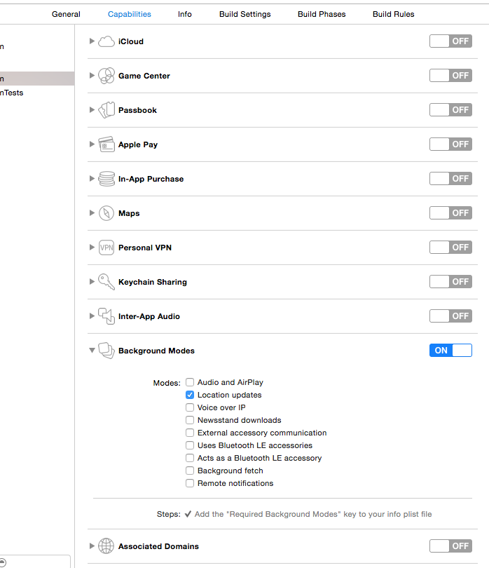
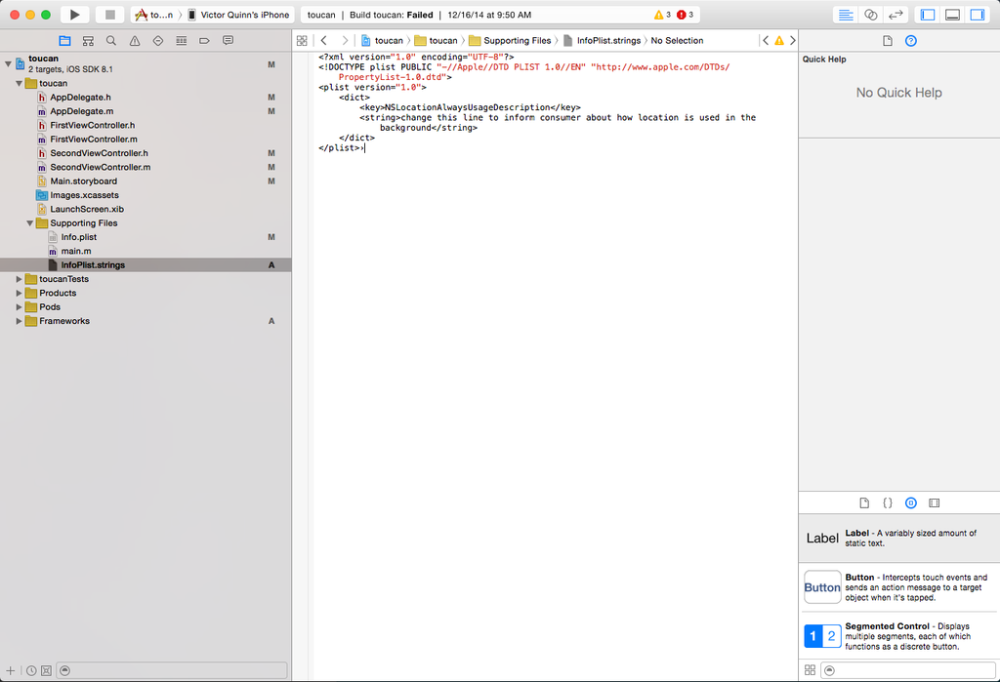
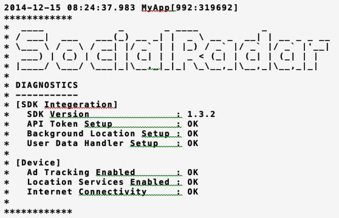

# Overview

## SocialRadar Location Manager

The SocialRadar Location Manager is designed to provide accurate location data to apps which require precise or continuous location services, passive venue check-in and detailed user insights based on the places your users go every day.

### How it works

SocialRadar SDK processes location signals through a private location manager instance, analyzing activity and validating data within the private SocialRadar cloud. Anonymized consumer insights may be shared with app publishers and marketing firms.

The SocialRadar Location Manager framework works independently of the host app, and other than the app providing match key data to the SDK framework, no interaction between the app and framework is required to enable SocialRadar Location Manager to work properly.

### Operating Requirements

-	Device capable of running iOS 7.x or above (Android coming soon!)
-	Device capable of properly returning location signals

### Battery Consumption Safeguards

Battery consumption is extremely efficient – the SocialRadar SDK averages 1.7% battery consumption per hour, depending on the type of device used. If remaining battery power dips below 21%, the SDK pauses until the battery has been charged.

### Transparent operation

The SocialRadar Location Manager never surfaces dialog boxes, errors or notifications directly to a consumer.

### User Insights

Consumer interest profiles are indexed with match keys, allowing data to be properly analyzed and cross-referenced by app-created user data. Match keys include:

 * Device ID (IDFA) – automatically obtained by SocialRadar SDK
 * Home IP address – automatically obtained by SocialRadar SDK
 * E-mail address – provided by you through an API interface
 * Proprietary user IDs – provided by you through an API Interface

Match key data is handled in compliance with advertising industry privacy and data handling/security practices in the US and EU.

# Getting Started (iOS)

Adding the SocialRadar SDK to an app is easy:

## 1. Obtain an API Key

For now, email [sdk@socialradar.com](mailto:sdk@socialradar.com) to request a key until our full developer site is ready.

## 2. Retrieve and integrate the SDK

You can either:

### Download Manually

1. Download the latest version [here](#downloads)
1. Add the **SocialRadar.framework** file to your project
1. Using Xcode, navigate to your project target's "General" settings; in the "*Linked Frameworks and Libraries*" section, add **SocialRadar.framework**

### Add SocialRadar as a CocoaPod

The SocialRadar SDK is available as a [CocoaPod](http://cocoadocs.org/docsets/SocialRadarSDK) for ease of integration.

1. Add the following to your Podfile: `pod 'SocialRadarSDK'`
1. Close your project in Xcode and update it by running `pod install` from **Terminal** in your project directory
1. Open your project in Xcode and perform a Clean build

## 3. Configure your Project

In the project target's **Capabilities** section, enable **Background Modes** and enable **Location Updates** as shown in the following screenshot:



## 4. Initialize

> For example, if you launch your Apple location manager services from within **AppDelegate.m**, add the following line above the **@implementation** section:

```objective_c
#import <SocialRadar/SocialRadar.h>
```

> From within appdelegate.m’s application:didFinishLaunchingWithOptions: method, add the following lines to initialize and launch SocialRadar Location Manager:

```objective_c
// Initialize
[SocialRadar initializeWithApiToken:@"<yourApiTokenHere>"];

// Start it
[[SocialRadar sharedInstance] startServices];
```

The SocialRadar Location Manager SDK requires the use of the Apple location manager.

Start the SocialRadar Location Manager at the point after your app normally begins collecting location data – ideally, it should be run immediately after requesting your user’s permission to access location data and while the app is still in the foreground.

Remember to replace `<yourAPITokenHere>` with the API token supplied to you by SocialRadar.

The return result of `[SocialRadar sharedInstance]` will be nil if called before the `[SocialRadar initializeWithApiToken:@"<yourApiTokenHere>"]` method is invoked.


## 5. Configuring permissions

> We recommend the following InfoPlist.strings file configuration (adjust the language as required by your app):

```xml
<?xml version="1.0" encoding="UTF-8"?>
<!DOCTYPE plist PUBLIC "-//Apple//DTD PLIST 1.0//EN" "http://www.apple.com/DTDs/PropertyList-1.0.dtd">
<plist version="1.0">
    <dict>
        <key>NSLocationAlwaysUsageDescription</key>
        <string>Change this line to inform consumer about how location is being used in the background</string>
    </dict>
</plist>
```


Using SocialRadar Location Manager requires the consumer to receive an informational message explaining how location services will be used within the app.

That informational message is contained in the Info.plist or the InfoPlist.strings file.



If your app will run on iOS 7.x, you must add a `NSLocationUsageDescription` entry in addition to the `NSLocationlAlwaysUsageDescription` entry.

If successfully implemented, the consumer will receive a standard location services notification request dialog box presenting them with a request for location services and why the location services are being requested.

If the consumer chooses not to authorize location services, SocialRadar Location Manager will suspend activity until the consumer authorizes location services.


## 6. Ensuring it works

> Enable **Developer Diagnostics** by placing the following code immediately following the SDK initialization code:

```objective_c
#if DEBUG
    [[SocialRadar sharedInstance] printDeveloperDiagnostics];
#endif
```

SocialRadar Location Manager operates in the background, and will not perform heavy operations, nor produce NSNotifications nor NSLogs which may interfere with the performance of your app.

The best way to determine a successful SocialRadar Location Manager implementation is to enable **Developer Diagnostics** when running the app in developement.

If successful, you will see the following in your console:



Remember to remove these debug lines prior to releasing your app to the App Store!

# Getting Started (Android)

Unfortunately, at this time the SocialRadar SDK for Android is currently in internal beta only.

If you are interested in receiving early access, send an email to [sdk@socialradar.com](mailto:sdk@socialradar.com).

# Initialization

> To initialize the SocialRadar SDK, use the following code:

```objective_c
// The following should go in your AppDelegate.m above the @implementation section
#import <SocialRadar/SocialRadar.h>

// The following should go in your AppDelegate.m file in application:didFinishLaunchingWithOptions: method
[SocialRadar initializeWithApiToken:@"<yourApiTokenHere>"];

[[SocialRadar sharedInstance] startServices];
```

```java
import SocialRadar

// This is not real since the Android library has not yet been launched...
```

The SocialRadar SDK uses API tokens to allow access to the API.

Until our developer portal is finished (coming soon!), you can get an API token by emailing [sdk@socialradar.com](mailto:sdk@socialradar.com)

The SocialRadar SDK expects the API token to be included in all API requests to the server and without one, the server will reject requests.

<aside class="notice">
You must replace `<yourApiTokenHere>` with your app's API key.
</aside>

# SocialRadar Location Manager

Now that you've implemented the SocialRadar Location Manager, you’re able to obtain location data on demand.

The location data you will receive is a CLLocation object returning a refined coordinate for the user’s current position.

There are two methods of returning data: single point request and continuous streaming.

## Single Location Point Request

> To quickly obtain the user’s most recent location point, execute the following:

```objective_c
[SocialRadar.sharedInstance getLocationWithCompletionHandler:^(CLLocation *location, NSError *error) {
    if (error == nil) {
        NSLog(@"%.6f, %.6f, %@", location.coordinate.latitude, location.coordinate.longitude, location.timestamp);
    } else {
        NSLog(@"Error: %@", error);
    }
}];
```

Single point requests do not increase battery consumption rates.

You will quickly receive the user's most recent location point to the provided handler.

## Continuous Stream of Location Point Updates

> To start streaming location tracking, use the following (substitute the *SRActivityTypeRunning* with the activity tracking option you require):

```objective_c
[SocialRadar.sharedInstance startMonitoringActivityType:SRActivityTypeRunning updateHandler:^(CLLocation *location, NSError *error) {
    if (error == nil) {
        NSLog(@"Activity location %@", location);
    } else {
        NSLog(@"Activity error %@", error);
    }
}];
```

> To stop streaming location tracking, use the following:

```objective_c
[SocialRadar.sharedInstance stopMonitoringActivityType];
```

Streaming location Streaming location data Streaming location data is available when a continuous real-time feed of location data is required.

The SocialRadar SDK offers location data streams optimized by user.

Selecting the right user activity type when initiating streaming location tracking ensures the right algorithm is used to refine the GPS data.

If you’re unsure which activity type to track, choose SRActivityTypeRunning – this will provide accurate GPS data useful for most activity tracking requirements.

The SRActivityType defines the activity you wish to track. Each type is optimized for processing speed, battery life and accuracy. The activity types offered are:

* **SRActivityTypeLowPower** – suitable for continuous very low power GPS signaling (3.3%/hour on average). New location signals will arrive every 1-2 seconds when moving, less frequently if not moving.
* **SRActivityTypeWalking** — suitable for general fitness, sports, and walking <15mph.
* **SRActivityTypeRunning** – tracking for activity speeds <25mph.
* **SRActivityTypeCycling** – tracking for speeds <40mph on land and water.
* **SRActivityTypeDriving** – automotive tracking with ‘snap-to-road’.

The location object will update as new location data becomes available. This data will include both highly refined and lightly refined data points suitable for mapping an activity.

In order to minimize battery usage, it is recommended that you enable the continuous stream only for the period your app needs that type of GPS update and disable it when that is no longer needed.

For example, for an app that tracks runs, start continuous updates when the user starts their run and stop when the user indicates their run is finished.

Stopping activity tracking will not stop the SocialRadar SDK -- it only stops the activity type tracking you have chosen. Note, only one activity tracking function will operate at any time.

# Data Sharing and Runtime Options

## Pass Email, Gender, and Age

> At any point after SocialRadar Location Manager has launched, you can pass consumer email, gender and/or age data to SocialRadar using the following syntax:

```objective_c
[SocialRadar sharedInstance].userDataHandler = ^(NSString *key, NSError *error) {
    if (error == nil) {
        NSLog(@"PASSED: key=%@", key);
    } else {
        NSLog(@"ERROR: key=%@ | error=%@", key, error);
    }
};

NSString *firstName = firstNameTextField.text;
[SocialRadar.sharedInstance sendUserDataValue:firstName forKey:kSRUserKeyFirstName];

```
> In addition to first name, you can send any of the following keys by repeating the same sendUserDataValue operation outlined above:

```objective_c
NSString *const kSRUserKeyAge;
NSString *const kSRUserKeyGender;
NSString *const kSRUserKeyFirstName;
NSString *const kSRUserKeyLastName;
NSString *const kSRUserKeyFullName;
NSString *const kSRUserKeyEmailAddress;
NSString *const kSRUserKeyPhoneNumber;
NSString *const kSRUserKeyCustomID;
```

A user’s email address, gender and age assist in building user interest profiles and in connecting user profiles to third party data sources, resulting in more useful user insights.

E-mail is never used to contact consumers, and e-mail addresses hashed using SHA-1 prior to performing matching functions with third parties.


# Downloads

## iOS

### CocoaPods

Coming soon!

<!-- The SocialRadar SDK (iOS) can be easily installed from CocoaPods.

1. Add the following to your Podfile: `pod 'SocialRadarSDK'`
1. Close your project in Xcode and update it by running `pod install` from **Terminal** in your project directory
1. Open your project in Xcode and perform a Clean build -->

### Manual Download

Please contact the SocialRadar SDK team on [sdk@socialradar.com](mailto:sdk@socialradar.com) to obtain an API key and a copy of LocationKit.

## Android

Currently in internal beta, coming soon!

### Maven

### Manual Download
